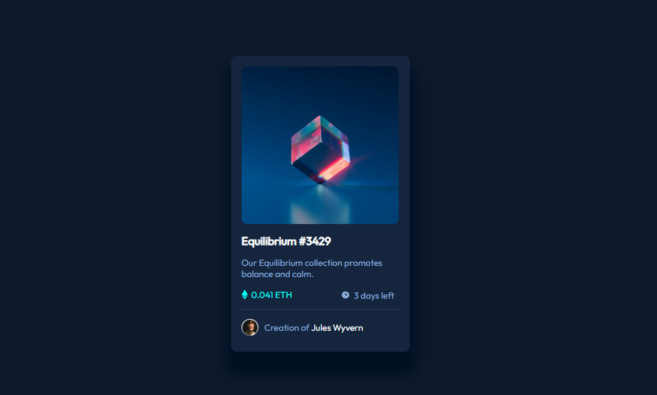
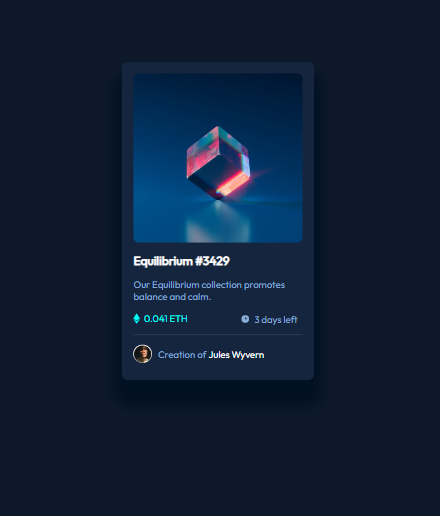
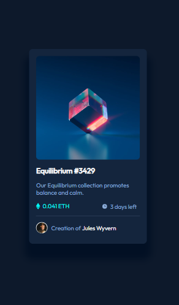

# FM - NFT preview card solution

This is a solution to the [NFT preview card component challenge on Frontend Mentor](https://www.frontendmentor.io/challenges/nft-preview-card-component-SbdUL_w0U). Frontend Mentor challenges help you improve your coding skills by building realistic projects. 

## Table of contents

- [Overview](#overview)
  - [The challenge](#the-challenge)
  - [Used Technologies](#used-technologies)
  - [Screenshot](#screenshot)
  - [Links](#links)
- [Author](#author)

**Note: Delete this note and update the table of contents based on what sections you keep.**

## Overview

### The challenge

Users should be able to:

- View the optimal layout depending on their device's screen size

### Used Technologies

- HTML5
- CSS3 custom properties

### Screenshot

### Links

- Solution URL: [Click Here](https://debarunmitra.github.io/FM-NFT-preview-card/)

## Author

- Github - [DebarunMitra](https://debarunmitra.github.io/FM-NFT-preview-card/)
- Frontend Mentor - [@DebarunMitra](https://www.frontendmentor.io/profile/DebarunMitra)
- LinkedIn - [DebarunMitra](https://www.linkedin.com/in/debarunmitra876665190/)
